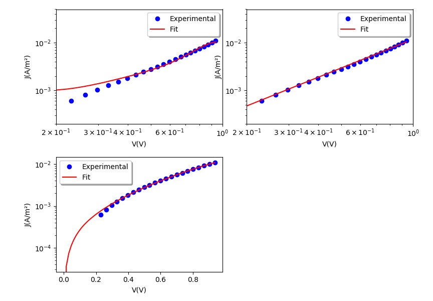

# dark-fitter
Fits JxV curves obtained from solar cells operating in the dark and calculates important parameters.

## How does this works?
The program reads a .dat or .txt file with experimental data from JxV (current density vs applied voltage) measurements made in solar cells operating in the dark. The program fits theoretical functions into experimental data through the Ordinary Least Squares regression method, so the user needs to input the desired residual (experimental function (y) - theoretical function). The user can also include the desired initial value for the parameters in the theoretical function (can be 0). The program will iterate untill the residual is closer to 0, after this, if all went well, you will have the best fit. After this it prints the parameters obtained through the fitting proccess, and plots the fitted function alongside the experimental data.

## Examples

``
$~ python3 dark.py
``

In this example the data was fitted with 3 different models (Richardson-Schottky, Mott-Gurney for space charge limited current and a circuital model created by Marlus et al (doi:10.1063/1.4813759)). To extract the correct parameters you need to know with which model you are working with.
